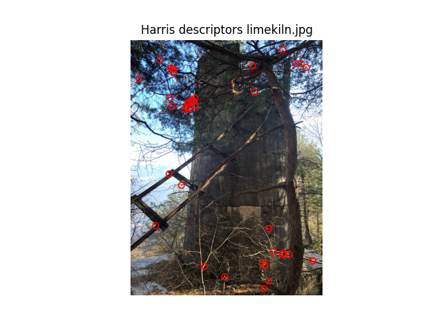

---
title:
- Feature Detection and Tracking
subtitle:
- Computer Vision Assignment
aspectratio:
- 43
institute:
- University of Trento
author:
- \href{https://github.com/samuelebortolotti}{Samuele Bortolotti}
date:
- \today
lang:
- en-US
section-titles:
- false
theme:
- Copenhagen
colortheme:
- default
navigation:
- horizontal
logo:
- img/unitn.pdf
fontsize:
- 10mm
bibliography: bibliography.bib
link-citations: true
nocite: |
  @*
---

# Introduction

## Proposed method

Feature detectors:

- Harris corner detector
- Simple Blob detector
- SIFT
- ORB

All complemented with:

- Lucas-Kanade optical flow
- Kalman filter

# Tracking

::: {.columns align=center}

:::: column

## Lucas-Kanade

{height=80%}

::::

:::: column

## Kalman filter

{height=80%}

::::

:::

# Lucas-Kanade

- Flawless way of tracking features in a slowly moving environment;
- Test video compliant with the Optical Flow assumptions;
- Achieves better performances with respect to the Kalman filter in the test video

# Kalman filter

::: {.columns align=center}

:::: column

- Lack of observations;
- Observations provided though a brute force matcher;
- Descriptors are needed

::::

:::: column

Proposed pipeline

{height=80%}

::::

:::

# Harris Corner detector

::: {.columns align=center}

:::: column

- Simple;
- Positive result;
- Few keypoints detected

::::

:::: column

{height=80%}

::::

:::

# Simple Blob detector

::: {.columns align=center}

:::: column

- Context dependent;
- Not scale invariant;
- Do not work with Kalman since few keypoints are detected

::::

:::: column

{height=80%}

::::

:::

# ORB detector

::: {.columns align=center}

:::: column

- Fast;
- Well distributed keypoints;
- The best I have tried in terms of quality/time performances

::::

:::: column

{height=80%}

::::

:::

# SIFT detector

::: {.columns align=center}

:::: column

- The most accurate among those tried;
- Astonishing results if devices posses high computational capabilities;
- Impractical with the Kalman filter pipeline I have proposed

::::

:::: column

{height=80%}

::::

:::

# References {.allowframebreaks}